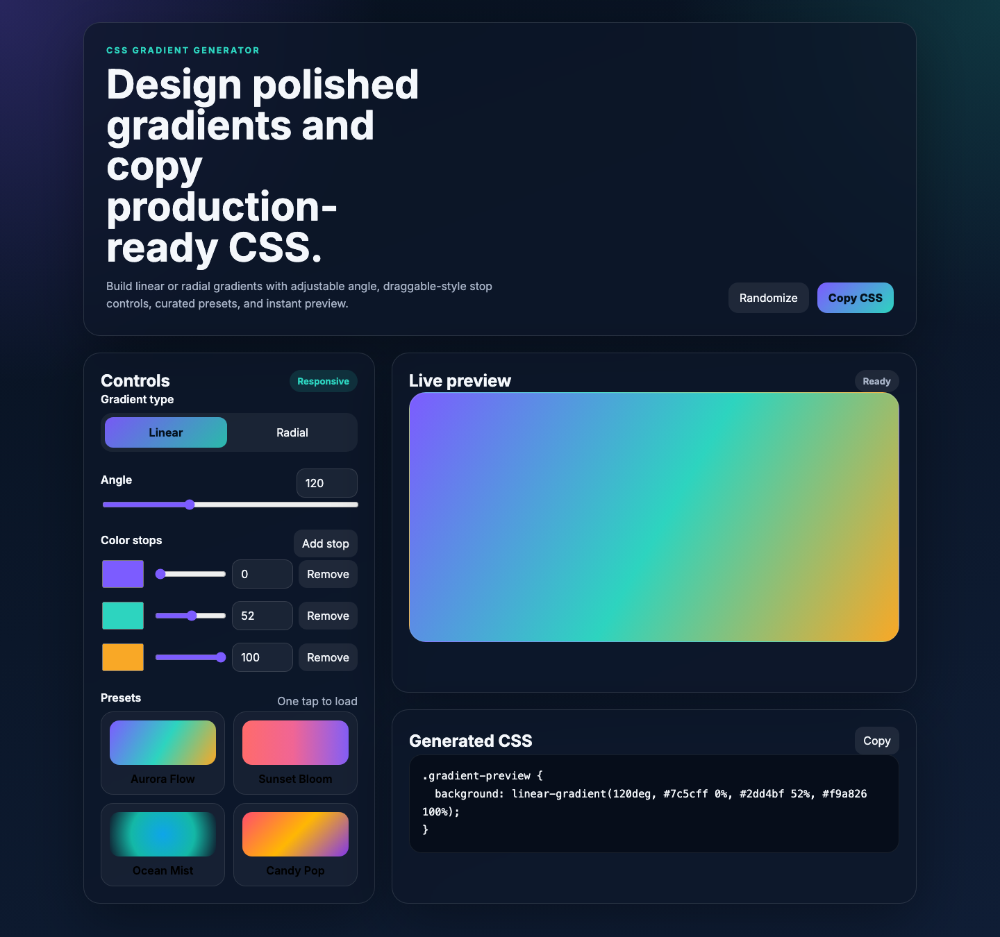

# CSS Gradient Generator

A polished static web tool for building CSS gradients visually. It supports linear and radial gradients, multiple color stops, presets, randomization, live preview, and one-click CSS copy.

## Live Demo

https://afunls.github.io/css-gradient-gen/

## Features

- Linear and radial gradient modes
- Adjustable angle control for linear gradients
- Multiple color stops with position controls
- Curated preset gradients
- Randomize button for inspiration
- Live preview panel
- One-click copy-to-clipboard for generated CSS
- Responsive layout for desktop and mobile

## Usage

1. Choose **Linear** or **Radial**.
2. Adjust the angle if using a linear gradient.
3. Edit color stops, positions, or add/remove stops.
4. Click a preset for a quick starting point or use **Randomize**.
5. Click **Copy CSS** to copy the generated code.

## Example Output

```css
.gradient-preview {
  background: linear-gradient(120deg, #7c5cff 0%, #2dd4bf 52%, #f9a826 100%);
}
```

## Screenshot



## Local Development

Open `index.html` directly in a browser, or serve the directory with a static file server.

## Deployment

This project is deployed with GitHub Pages from the `main` branch root.
